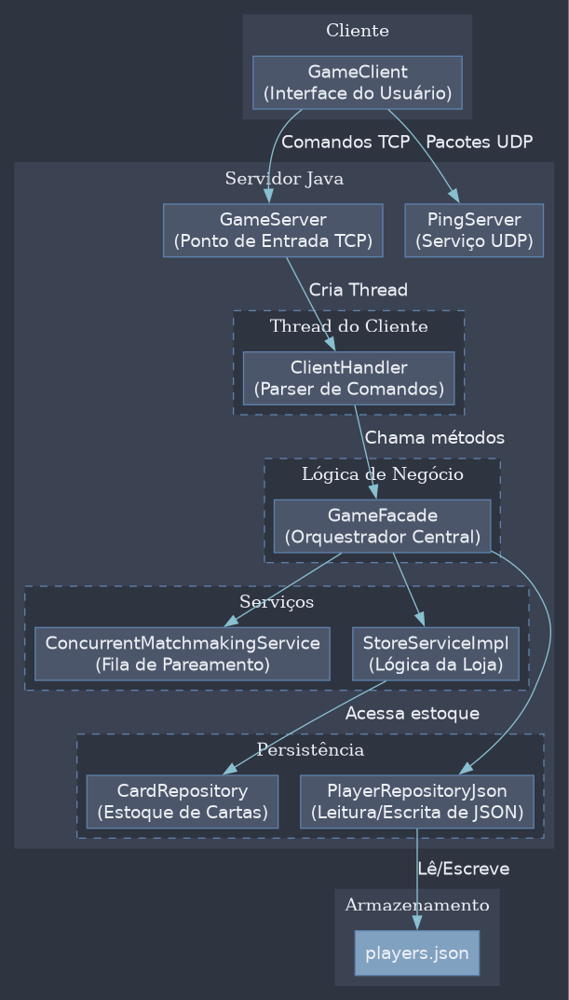

# Dueling Protocol

A server implementation for a multiplayer card game, built with a client-server architecture using TCP communication.

## Table of Contents

- [Overview](#overview)
- [Architecture](#architecture)
- [Features](#features)
- [Technologies](#technologies)
- [Prerequisites](#prerequisites)
- [Installation](#installation)
- [Running the Project](#running-the-project)
  - [With Docker](#with-docker)
  - [With Maven](#with-maven)
- [Communication Protocol](#communication-protocol)
- [Testing](#testing)
- [Project Structure](#project-structure)
- [Contributing](#contributing)
- [License](#license)

## Overview

Dueling Protocol is a server for a multiplayer card game that allows the creation of 1v1 matches between players. The server manages the entire game lifecycle, from matchmaking to match resolution, and also offers features like a card shop, character upgrade system, and latency measurement.

## Architecture

The project follows a classic client-server model:

- **Server**: A Java application that manages the core game logic, including matchmaking, match sessions, card pack purchases, and player data persistence.
- **Clients**: Any application (desktop, mobile, web) capable of communicating via TCP sockets. The project includes a `GameClient` as an example implementation.



## Features

- ✅ **TCP/UDP Communication**: Main communication via TCP and latency measurement via UDP
- ✅ **1v1 Matchmaking**: Queue system to pair players
- ✅ **1v1 Matches**: Complete match system between two players
- ✅ **Card Shop**: Purchase card packs to expand the deck
- ✅ **Upgrade System**: Improve character attributes with points earned from victories
- ✅ **Data Persistence**: Storage of player data in JSON format
- ✅ **Thread-Safe Concurrency**: Multithreaded architecture with safe data structures
- ✅ **Latency Measurement**: Ping system to monitor connection quality
- ✅ **Disconnection Handling**: Management of abrupt client disconnections

## Technologies

- Java 21
- Maven
- Docker
- TCP/UDP Sockets
- Gson (for JSON serialization)
- SLF4J/Logback (for logging)
- JUnit (for testing)

## Prerequisites

- Java 21
- Maven 3.8+
- Docker (optional, but recommended)
- Docker Compose (optional, but recommended)

## Installation

### With Docker (Recommended)

```bash
# Clone the repository
git clone <repository-url>
cd dueling-protocol

# Build the Docker image
./build.sh
```

### With Maven

```bash
# Clone the repository
git clone <repository-url>
cd dueling-protocol

# Compile the project
mvn clean package
```

## Running the Project

### With Docker

```bash
# Start the server
./run_server.sh

# In another terminal, start a client
./run_client.sh
```

Or using docker-compose:

```bash
# Start the server
docker-compose up server

# In another terminal, start a client
docker-compose up client
```

### With Maven

```bash
# Start the server (in the target/ folder)
java -jar dueling-protocol-1.0-SNAPSHOT.jar

# In another terminal, start a client
java -cp dueling-protocol-1.0-SNAPSHOT.jar GameClient
```

## Communication Protocol

The communication between client and server is text-based and uses TCP for critical actions and UDP for latency measurement.

### General Format (TCP)

```
COMMAND:PLAYER_ID:ARG1:ARG2...
```

### Main Commands

| Command | Format | Description |
| :--- | :--- | :--- |
| `CHARACTER_SETUP` | `CHARACTER_SETUP:<playerId>:<race>:<class>` | Defines the race and class of the player's character. |
| `MATCHMAKING` | `MATCHMAKING:<playerId>` | Adds the player to the queue to find a match. |
| `STORE` | `STORE:<playerId>:BUY:<packType>` | Buys a card pack of a specific type. |
| `GAME` | `GAME:<playerId>:PLAY_CARD:<matchId>:<cardId>` | Executes the action of playing a card during a match. |
| `UPGRADE` | `UPGRADE:<playerId>:<attribute>` | Improves a player attribute using upgrade points. |

### Server Responses

The server responds with prefixes that indicate the result of the operation:

- `SUCCESS`: Action executed successfully.
- `ERROR`: An error occurred while processing the command.
- `UPDATE`: Sends an asynchronous update to the client (start of a match, card purchase, etc.).

## Testing

The project includes a complete suite of automated tests that cover various scenarios:

### Scenario Tests

```bash
# Run all scenario tests
./run_all_tests.sh
```

### Stress Test

```bash
# Run a stress test with 10 simultaneous clients
./stress_test.sh
```

The tests cover:
- Abrupt disconnections during matchmaking and matches
- Race conditions in data persistence
- Simultaneous moves
- Handling of malformed inputs

## Project Structure

```
src/main/java/
├── controller/          # Controllers and facades
├── model/               # Data models and entities
├── repository/          # Data access layer
├── service/             # Business logic
│   ├── matchmaking/     # Matchmaking services
│   └── store/           # Store services
├── GameServer.java      # Main server class
├── GameClient.java      # Example client
├── ClientHandler.java   # Handler for client connections
└── PingServer.java      # UDP server for latency measurement
```

## Contributing

1. Fork the project
2. Create a branch for your feature (`git checkout -b feature/AmazingFeature`)
3. Commit your changes (`git commit -m 'Add some AmazingFeature'`)
4. Push to the branch (`git push origin feature/AmazingFeature`)
5. Open a Pull Request

## License

Distributed under the MIT License. See `LICENSE` for more information.
