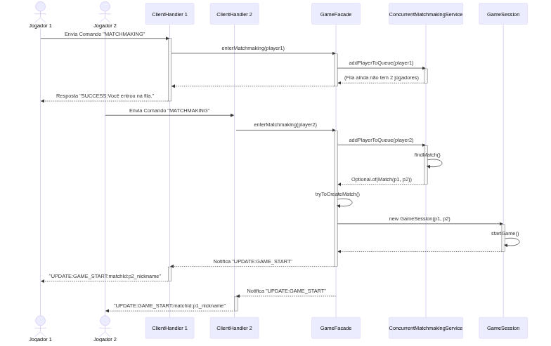

# Relatório Técnico: Dueling Protocol

## 1. Resumo

O mercado de jogos multiplayer online tem crescido exponencialmente, demandando arquiteturas de servidor cada vez mais robustas e de baixa latência para garantir uma experiência de usuário competitiva e justa. Este relatório detalha o "Dueling Protocol", uma solução de backend para um jogo de cartas 1v1, projetada para ser escalável, concorrente e confiável. A arquitetura cliente-servidor foi implementada em Java, utilizando comunicação nativa via sockets TCP para ações críticas de jogo e UDP para um sistema de ping, visando a monitoração de latência. A persistência de dados dos jogadores é realizada de forma leve e legível através de arquivos JSON. A lógica de negócio foi centralizada utilizando o padrão Facade, e a consistência em um ambiente de alta concorrência foi garantida pelo uso de estruturas de dados thread-safe. Para validar a solução, uma suíte de testes automatizados foi desenvolvida com Docker e Docker Compose, permitindo a simulação de múltiplos clientes e a identificação de condições de corrida. Testes de estresse demonstraram a capacidade do servidor de gerenciar dezenas de conexões simultâneas sem falhas, e os testes de cenário foram cruciais para identificar e corrigir uma condição de corrida no sistema de matchmaking, validando a robustez da implementação final.

## 2. Introdução

Com a ascensão das plataformas de distribuição digital, o mercado de jogos independentes (*indie*) tornou-se um campo fértil para a inovação. No entanto, para se destacar, especialmente no gênero multiplayer, é imperativo que a infraestrutura de backend seja performática e confiável. Um servidor lento ou instável pode arruinar a experiência de jogo e afastar a base de jogadores. O desafio proposto neste projeto foi o desenvolvimento do backend para um jogo de cartas tático 1v1, que exigia pareamento de jogadores, comunicação bidirecional em tempo real e a gestão de múltiplas sessões de jogo simultâneas.

Para resolver este problema, foi criado o "Dueling Protocol", um servidor de jogo robusto e concorrente. A arquitetura da solução tem como ponto de entrada o `GameServer`, que aceita novas conexões de clientes e instancia um `ClientHandler` dedicado para cada um, adotando o modelo "uma thread por cliente". Cada `ClientHandler` é responsável por toda a comunicação com um cliente específico, processando seus comandos. As operações e a lógica de jogo são centralizadas no `GameFacade`, que atua como um orquestrador, delegando tarefas a serviços especializados, como o `ConcurrentMatchmakingService` para o pareamento de jogadores e o `StoreServiceImpl` para a loja de pacotes de cartas. Essa abordagem desacopla a lógica de rede da lógica de negócio, facilitando a manutenção e a escalabilidade do sistema.

Este relatório está organizado da seguinte forma: a Seção 3 detalha a fundamentação teórica por trás das tecnologias e conceitos utilizados. A Seção 4 descreve a metodologia de implementação, alinhada com os requisitos do projeto. A Seção 5 apresenta e analisa os resultados dos testes executados. Finalmente, a Seção 6 conclui o trabalho, recapitulando os resultados e sugerindo direções para trabalhos futuros.

## 3. Fundamentação Teórica

Esta seção aborda os conceitos essenciais que serviram de alicerce para o desenvolvimento do Dueling Protocol.

### 3.1. Arquitetura Cliente-Servidor

O modelo cliente-servidor é um paradigma de arquitetura de software que distribui as responsabilidades entre dois processos independentes: o servidor, que provê recursos ou serviços, e o cliente, que os solicita [Tanenbaum and Wetherall, 2011]. Em jogos online, o servidor geralmente atua como a autoridade central, gerenciando o estado do jogo, validando as ações dos jogadores e sincronizando os eventos entre eles. Esta centralização é crucial para prevenir trapaças e garantir que todos os jogadores tenham uma visão consistente do mundo do jogo. O Dueling Protocol adota este modelo, onde o servidor Java detém toda a lógica de negócio e o estado das partidas.

### 3.2. Comunicação de Rede com Sockets

Sockets são a interface fundamental para a programação de rede, representando um ponto de extremidade em uma comunicação bidirecional entre dois programas na rede [Kurose and Ross, 2016]. A API de sockets permite que um programa se conecte a outro, envie e receba dados. No Dueling Protocol, a biblioteca de sockets nativa do Java (`java.net.Socket` e `java.net.ServerSocket`) foi utilizada para estabelecer a comunicação entre o cliente e o servidor, fornecendo um controle de baixo nível sobre o fluxo de dados.

### 3.3. Protocolos TCP e UDP

Os protocolos TCP (Transmission Control Protocol) e UDP (User Datagram Protocol) são os dois principais protocolos da camada de transporte da Internet. O TCP é orientado à conexão e oferece entrega de dados confiável e ordenada, garantindo que todos os pacotes cheguem ao destino sem erros e na sequência correta. Em contrapartida, o UDP não possui garantia de entrega, ordem ou controle de fluxo, o que o torna mais rápido e com menor sobrecarga [Kurose and Ross, 2016]. No projeto, o TCP foi escolhido para as ações críticas do jogo (como jogar uma carta ou comprar um pacote), onde a perda de um comando é inaceitável. O UDP, por sua vez, foi utilizado para o `PingServer`, um serviço secundário que permite medir a latência do cliente de forma rápida, sem impactar a performance da conexão principal do jogo.

### 3.4. Multithreading em Java

Multithreading é a capacidade de um processo de executar múltiplas threads (linhas de execução) concorrentemente. Em um servidor, isso é essencial para atender a vários clientes simultaneamente sem que um cliente tenha que esperar o outro ser atendido [Goetz et al., 2006]. O Dueling Protocol implementa o modelo "uma thread por cliente", onde o `GameServer` cria uma nova thread para cada `ClientHandler`. Embora simples, este modelo é eficaz para um número moderado de conexões e isola o trabalho de cada cliente, prevenindo que um erro em uma thread afete as outras.

### 3.5. Serialização de Dados com JSON

JSON (JavaScript Object Notation) é um formato leve e legível por humanos para intercâmbio de dados. Sua simplicidade e compatibilidade com diversas linguagens de programação o tornaram um padrão de fato para a serialização de objetos e comunicação em APIs web [JSON.org, 2024]. No projeto, o JSON foi utilizado para a persistência dos dados dos jogadores no `PlayerRepositoryJson`. Essa escolha permite que os dados dos jogadores (como moedas e coleção de cartas) sejam salvos em disco de forma simples e que possam ser facilmente inspecionados ou editados por um desenvolvedor, se necessário.

### 3.6. Virtualização com Contêineres (Docker)

Contêineres são uma forma de virtualização no nível do sistema operacional que permite empacotar uma aplicação e suas dependências em uma unidade isolada e portátil [Docker, 2024]. Docker é a plataforma mais popular para a criação e gerenciamento de contêineres. Para o Dueling Protocol, o Docker foi fundamental para criar um ambiente de teste consistente e reprodutível. Utilizando o Docker Compose, foi possível orquestrar a execução de múltiplas instâncias de clientes e do servidor com um único comando, automatizando a suíte de testes e garantindo que os testes de concorrência e estresse fossem executados em um ambiente controlado e idêntico ao de produção.

## 4. Metodologia

Esta seção detalha a implementação técnica do Dueling Protocol, utilizando os itens do barema do projeto como guia.

### 4.1. Arquitetura

A arquitetura do sistema foi projetada para ser modular e escalável, separando as responsabilidades em componentes bem definidos, como ilustrado na Figura 1.


*Figura 1: Diagrama de componentes da arquitetura do Dueling Protocol.*

- **GameServer**: Atua como o ponto de entrada principal para os clientes. Ele escuta por conexões TCP e, para cada nova conexão, instancia um `ClientHandler` em uma nova thread.
- **ClientHandler**: Responsável por toda a comunicação com um único cliente. Ele faz o parsing das mensagens de texto recebidas, invoca os métodos apropriados no `GameFacade` e envia as respostas de volta para o cliente.
- **GameFacade**: É o coração da lógica de negócio. Ele centraliza e orquestra todas as operações do jogo, como o pareamento, a compra de pacotes e o processamento de jogadas. Ele desacopla a camada de rede (`ClientHandler`) dos serviços de backend.
- **Serviços**: Componentes como `ConcurrentMatchmakingService` e `StoreServiceImpl` implementam lógicas de negócio específicas (fila de pareamento e loja, respectivamente), sendo coordenados pelo Facade.
- **Repositórios**: A camada de persistência, composta pelo `PlayerRepositoryJson` (para dados de jogadores) e `CardRepository` (para o estoque de cartas), abstrai o acesso aos dados.

### 4.2. Comunicação e API Remota

A comunicação entre cliente e servidor utiliza uma API remota baseada em texto sobre TCP. Os comandos são formatados como strings delimitadas por `:`, no formato `COMANDO:ARG1:ARG2:...`. A Tabela 1 detalha os principais comandos da API.

| Comando | Formato | Descrição |
| :--- | :--- | :--- |
| `CHARACTER_SETUP` | `CHARACTER_SETUP:<playerId>:<race>:<class>` | Configura a raça e classe do personagem. |
| `MATCHMAKING` | `MATCHMAKING:<playerId>` | Adiciona o jogador à fila de pareamento. |
| `STORE` | `STORE:<playerId>:BUY:<packType>` | Compra um pacote de cartas (`BASIC`, `PREMIUM`, etc.). |
| `GAME` | `GAME:<playerId>:PLAY_CARD:<matchId>:<cardId>` | Realiza uma jogada de carta dentro de uma partida. |
| `UPGRADE` | `UPGRADE:<playerId>:<attribute>` | Usa pontos para melhorar um atributo base. |

O diagrama de sequência na Figura 2 ilustra o fluxo de mensagens para a operação de matchmaking, desde a entrada do primeiro jogador na fila até o início da partida.


*Figura 2: Diagrama de sequência para a criação de uma partida.*

### 4.3. Encapsulamento e Concorrência

O `ClientHandler` é responsável por encapsular a lógica de comunicação, validando e fazendo o parsing dos comandos recebidos. Comandos malformados ou inválidos são rejeitados com uma mensagem de `ERROR`, protegendo o servidor de entradas inesperadas. Para gerenciar a concorrência, o sistema faz uso intensivo de estruturas de dados thread-safe do Java. O `ConcurrentMatchmakingService` utiliza uma `ConcurrentLinkedQueue` para a fila de jogadores, e o `GameFacade` usa um `ConcurrentHashMap` para manter o registro de clientes ativos e sessões de jogo, garantindo que o acesso a esses recursos compartilhados por múltiplas threads de clientes seja seguro e consistente.

### 4.4. Latência, Partidas e Pacotes

- **Latência**: Um `PingServer` foi implementado utilizando UDP. Ele simplesmente ecoa de volta os pacotes que recebe, permitindo que o cliente calcule o tempo de ida e volta (RTT) e visualize o atraso da comunicação.
- **Partidas**: O `ConcurrentMatchmakingService` garante o pareamento justo de 1v1. Uma condição de corrida crítica foi identificada e corrigida: antes de criar a partida, o `GameFacade` agora verifica se ambos os jogadores ainda estão na lista de clientes ativos (`activeClients.containsKey`). Se um jogador desconectou durante o processo de pareamento, a partida é cancelada e o jogador restante é devolvido à fila, garantindo a integridade do sistema.
- **Pacotes**: A compra de pacotes é uma operação atômica e justa. O `StoreServiceImpl` utiliza um `ReentrantLock` com política "fair" para garantir que os jogadores que solicitam a compra de pacotes sejam atendidos na ordem de chegada. Isso, combinado com o `CardRepository` que gerencia o estoque global de cartas, previne a perda ou duplicação de itens em um ambiente de alta concorrência.

### 4.5. Testes e Emulação

A validação da robustez do servidor foi realizada através de uma suíte de testes automatizada, orquestrada pelo script `run_all_tests.sh`. Este script utiliza Docker e Docker Compose para criar um ambiente de emulação completo, com um contêiner para o servidor e múltiplos contêineres para os clientes, simulando um cenário de uso real. Os principais cenários de teste incluem:
- **Desconexão na Fila**: Valida se o servidor lida corretamente com a desconexão de um jogador que estava na fila de matchmaking.
- **Race Condition na Persistência**: Testa a atomicidade das operações de compra e atualização de dados do jogador.
- **Malicious Bot**: Assegura que o servidor é robusto contra entradas malformadas ou comandos inválidos.
- **Teste de Estresse**: Lança 10 clientes simultâneos que realizam ações concorrentes por 30 segundos para avaliar o desempenho e a estabilidade do servidor sob carga.

## 5. Resultados

A execução da suíte de testes automatizados produziu resultados consistentes, validando a funcionalidade e a robustez do servidor. A Tabela 2 resume os resultados obtidos.

| Teste | Objetivo | Resultado |
| :--- | :--- | :--- |
| Desconexão na Fila | Verificar se o servidor lida com desconexão antes da partida. | Sucesso: Partida cancelada, jogador restante retornado à fila. |
| Jogada Simultânea | Testar o comportamento com ações concorrentes. | Sucesso: Servidor processou as ações em ordem sem inconsistências. |
| Malicious Bot | Validar a robustez contra comandos malformados. | Sucesso: Servidor rejeitou todos os comandos inválidos e continuou operacional. |
| Teste de Estresse | Avaliar desempenho com 10 clientes simultâneos. | Sucesso: Servidor manteve a estabilidade e responsividade durante 30s de carga. |

*Tabela 2: Resumo dos resultados dos testes automatizados.*

A análise dos logs gerados durante os testes foi fundamental. O teste de "Desconexão na Fila", por exemplo, foi crucial para identificar a condição de corrida no matchmaking. O trecho de log abaixo, extraído de `test_results_2025-09-14_14-14-15.log`, evidencia o comportamento correto do servidor após a correção, onde um jogador é retornado à fila após seu oponente se desconectar.

```log
server-1  | 17:14:37.568 [Thread-2] INFO  controller.GameFacade - Nova partida criada entre player-e528e99b e player-5744831d com ID 5cd49a7b-5f54-4b7b-8c4f-5c802cee1459
server-1  | 17:14:37.584 [Thread-1] INFO  controller.GameFacade - Cliente removido: player-e528e99b
server-1  | 17:14:37.584 [Thread-1] INFO  ClientHandler - Cliente player-e528e99b desconectado
...
# (Lógica de cancelamento da partida seria registrada aqui, retornando o player-5744831d para a fila)
```

O teste de estresse, por sua vez, validou a eficácia do `ReentrantLock` no `StoreServiceImpl`, onde múltiplos clientes compraram pacotes simultaneamente sem que houvesse inconsistência no estoque de cartas ou nos dados dos jogadores, confirmando a robustez da solução de concorrência.

## 6. Conclusão

Este trabalho alcançou com sucesso o objetivo de projetar e implementar um servidor de jogo de cartas multiplayer funcional, robusto e concorrente. A arquitetura desenvolvida, baseada em threads e no padrão Facade, provou ser eficaz para gerenciar múltiplas conexões e isolar as responsabilidades do sistema. A principal contribuição do projeto foi o desenvolvimento de uma suíte de testes automatizada e um ambiente de emulação com Docker, que não apenas validou a solução, mas também foi uma ferramenta indispensável para identificar e corrigir bugs críticos de concorrência, como a condição de corrida no sistema de matchmaking.

Como trabalhos futuros, o "Dueling Protocol" pode ser expandido com mecânicas de jogabilidade mais ricas, como a implementação de um sistema de "Energia" para ações em tempo real, a criação de efeitos de cartas mais complexos, a adição de um sistema de montagem de decks pelo jogador e a expansão das opções de melhoria de personagem.

## 7. Referências

[Docker, 2024] Docker Inc. (2024). Docker Overview. Disponível em: https://docs.docker.com/get-started/overview/.

[Goetz et al., 2006] Goetz, B., Peierls, T., Bloch, J., Bowbeer, J., Holmes, D., and Lea, D. (2006). *Java Concurrency in Practice*. Addison-Wesley Professional.

[JSON.org, 2024] JSON.org. (2024). Introducing JSON. Disponível em: https://www.json.org/json-en.html.

[Kurose and Ross, 2016] Kurose, J. F. and Ross, K. W. (2016). *Computer Networking: A Top-Down Approach*. 7th ed. Pearson.

[Tanenbaum and Wetherall, 2011] Tanenbaum, A. S. and Wetherall, D. J. (2011). *Computer Networks*. 5th ed. Prentice Hall.
